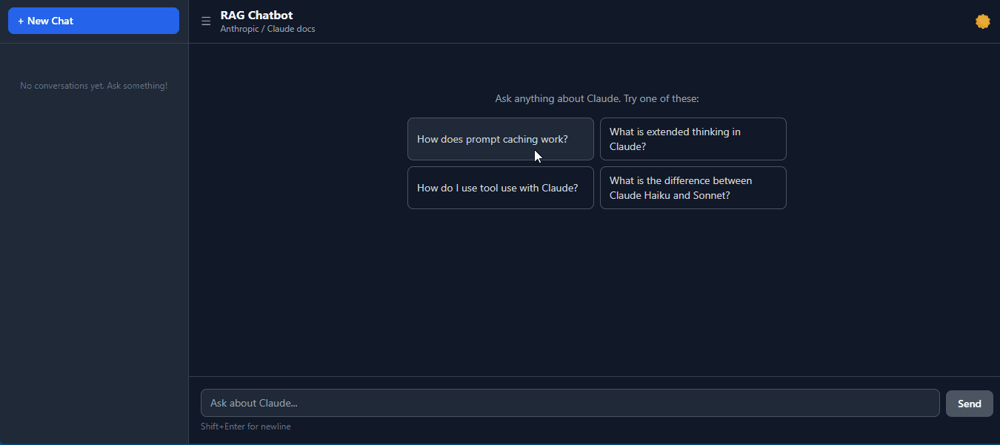
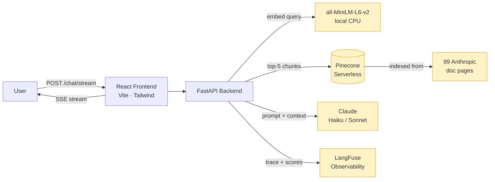

# rag-chatbot-template

> A production-grade RAG chatbot that answers questions about the **Anthropic / Claude documentation** — built with Claude itself. A meta portfolio piece demonstrating end-to-end mastery of the modern LLM engineering stack.

[](https://www.python.org/downloads/)
[](https://fastapi.tiangolo.com)
[](https://python.langchain.com)
[](LICENSE)

---



---

## ✨ What this demonstrates

- **RAG architecture end-to-end** — chunking, embedding, retrieval, grounding, citation enforcement
- **Three-stage retrieval pipeline** — BM25 keyword search + vector semantic search (RRF fusion) → cross-encoder reranker → 86% keyword recall
- **Multi-turn query contextualization** — follow-ups like "what's the cost?" are rewritten as standalone queries before retrieval, keeping conversation natural
- **LLM observability** — every query traced in LangFuse with latency, TTFT, sources, and keyword-recall scores
- **Evaluation discipline** — hand-curated 15-question eval set with progressive recall improvements documented across versions
- **Full-stack delivery** — FastAPI backend + React frontend (sidebar, dark mode, streaming) + Docker compose + HF Spaces
- **Cost-aware engineering** — Claude Haiku in dev; free-tier Pinecone serverless; local HuggingFace embeddings + cross-encoder (no API key)

---

## 🏗️ Architecture



**Request flow:**

1. User sends a question → frontend POST `{messages}` to `/chat/stream`
2. Backend embeds the question with `all-MiniLM-L6-v2` (local, free)
3. Pinecone returns the **top-5 most semantically similar** chunks from 4,788 indexed doc chunks
4. LangChain assembles a grounded prompt with a strict citation-enforcement system message
5. Claude generates an answer using **only** the retrieved context
6. SSE streams tokens to the frontend as they arrive; sources emit as a first event
7. LangFuse records the full trace — input, output, retrieved sources, latency, keyword-recall score

---

## 🚀 Quick Start

### Prerequisites

- Docker Desktop
- API keys: [Anthropic](https://console.anthropic.com/), [Pinecone](https://app.pinecone.io/), [LangFuse](https://cloud.langfuse.com/)

### 1. Clone and configure

```bash
git clone https://github.com/YOUR_USERNAME/rag-chatbot-template.git
cd rag-chatbot-template
cp .env.example .env
# Fill in your API keys in .env
```

### 2. Launch with Docker Compose

```bash
docker compose up --build
```

This builds the backend (~569 MB, torch-cpu) and frontend (~93 MB, nginx) images and starts both services.

### 3. Index the documentation *(first time only, ~3–5 min)*

```bash
curl -X POST http://localhost:8000/ingest
```

This scrapes 99 Anthropic documentation pages, splits them into ~4,800 chunks, embeds them locally, and upserts to Pinecone.

### 4. Open the chat UI

- **Chat:** http://localhost:5173
- **API docs (Swagger):** http://localhost:8000/docs

---

## 🗂️ Project Structure

```
rag-chatbot-template/
├── backend/
│   ├── app/
│   │   ├── config.py           # Pydantic settings — fail-fast on missing env vars
│   │   ├── main.py             # FastAPI app + CORS + SPA static serving (HF Spaces)
│   │   ├── routers/
│   │   │   ├── chat.py         # POST /chat (sync) + POST /chat/stream (SSE)
│   │   │   └── ingest.py       # POST /ingest
│   │   └── services/
│   │       ├── embeddings.py   # HuggingFace MiniLM singleton
│   │       ├── vectorstore.py  # Pinecone serverless wrapper
│   │       ├── ingest.py       # Scrape → split → embed → upsert (99 doc URLs)
│   │       ├── rag_chain.py    # LCEL pipeline: retriever | prompt | Claude | parser
│   │       ├── reranker.py     # HuggingFace cross-encoder singleton + rerank()
│   │       └── tracing.py      # LangFuse CallbackHandler factory
│   └── Dockerfile
├── frontend/
│   ├── src/
│   │   ├── App.tsx             # Chat UI — messages, sources, streaming cursor
│   │   ├── useChat.ts          # Hook: SSE consumer + conversation state
│   │   └── types.ts            # Shared TypeScript interfaces
│   └── Dockerfile              # Multi-stage: Node build → nginx serve
├── evaluation/
│   ├── datasets/
│   │   └── eval_questions.json # 15 hand-curated questions with expected keywords
│   └── run_eval.py             # Hits /chat, scores recall, pushes to LangFuse
├── docs/
│   └── architecture.md
├── docker-compose.yml          # Local dev: backend + frontend
├── Dockerfile.hf               # HF Spaces: single-container (FE + BE)
└── PRD.md                      # Product requirements document
```

---

## 🔧 Customization

| To change... | Edit... |
|---|---|
| Source documentation | `backend/app/services/ingest.py` → `DOCS_URLS` list |
| LLM model | `.env` → `CLAUDE_MODEL=claude-sonnet-4-6` |
| Embedding model | `.env` → `EMBEDDING_MODEL` |
| Top-k retrieval | `.env` → `TOP_K` |
| System prompt | `backend/app/services/rag_chain.py` → `SYSTEM_PROMPT` |
| Eval questions | `evaluation/datasets/eval_questions.json` |

---

## 📊 Evaluation

Run the included evaluation harness against a live backend:

```bash
# backend must be running
python evaluation/run_eval.py
```

**Results by version (Claude Haiku 4.5):**

| Version | Retrieval pipeline | Avg recall | P50 latency |
|---|---|---|---|
| V1 | Vector-only (top-5) | 82% | 9.7 s |
| V2 reranker | Vector top-20 → cross-encoder top-5 | 82% | 12.3 s |
| **V2 hybrid** | BM25 + vector top-20 → cross-encoder top-5 | **86%** | 14.5 s (TTFT 12.3 s) |

**V2 hybrid per-category (15 questions):**

| Category | Recall | Notes |
|---|---|---|
| API reference | 100% | |
| Conceptual | 92% | +8% vs V1 |
| Lookup | 83% | |
| Multi-doc | 83% | Partial recovery vs V1 |
| **Refusal** | **75%** | **+25% vs V1 — BM25 surface scoping context** |

Scores are pushed to LangFuse automatically — visible in the dashboard grouped by trace.

**Key insight:** each retrieval technique solves a different problem.
BM25 catches exact keyword matches (`web_search`, `anthropic-version`); vector search catches semantic/paraphrased matches; cross-encoder reranker maximises precision by reading query + chunk together. Optimal recall requires all three.

---

## 🛣️ Roadmap

### V2 — RAG Quality Depth ✅ Complete
- [x] HuggingFace cross-encoder reranker (ms-marco-MiniLM, local, no API key)
- [x] Hybrid search (`EnsembleRetriever` BM25 + vector, RRF fusion)
- [x] Multi-turn query contextualization (follow-ups rewritten before retrieval)
- [x] Token-level eval metrics (TTFT + chunks/sec pushed to LangFuse)
- [x] Frontend: sidebar history, dark mode, timestamps, copy button, streaming UX
- [x] Animated demo GIF

### V3 — Optional Stretch
- [ ] LLM-as-judge scorer alongside keyword recall
- [ ] GitHub Actions CI (ruff + eslint + pytest on PR)
- [ ] Multi-doc toggle (Anthropic / FastAPI / dbt indexes)
- [ ] Redis-backed session persistence
- [ ] Hugging Face Space live demo

---

## 🚢 Deploy to Hugging Face Spaces

```bash
# Test the single-container image locally before pushing
docker build -t rag-chatbot-hf .
docker run -p 7860:7860 --env-file .env rag-chatbot-hf

# Then add the HF Space as a git remote and push
git remote add hf https://huggingface.co/spaces/YOUR_USERNAME/YOUR_SPACE
git push hf main
```

The root `Dockerfile` builds the React frontend (no `VITE_BACKEND_URL` → relative URLs) and bundles it into the Python image. FastAPI detects `dist/` at startup and serves the SPA alongside the API on port 7860.

---

## 📄 License

MIT © Pablo

---

## 🙌 Stack

[FastAPI](https://fastapi.tiangolo.com) · [LangChain](https://python.langchain.com) · [Pinecone](https://www.pinecone.io) · [Anthropic Claude](https://www.anthropic.com/claude) · [LangFuse](https://langfuse.com) · [React](https://react.dev) · [Vite](https://vitejs.dev) · [Tailwind CSS](https://tailwindcss.com)
