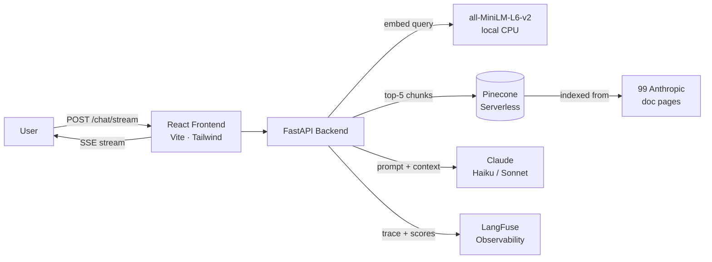

# Architecture

## High-Level Diagram

## Request Flow

1. **Frontend** POST `{messages: [...], session_id}` → `/chat/stream`
2. **Router** splits messages into `history` (prior turns) + `question` (last user message)
3. **Retriever** embeds the question with `all-MiniLM-L6-v2` (local, 384-dim, L2-normalized)
4. **Pinecone** cosine-similarity search → top-5 chunks from 4,788 indexed chunks
5. **LangFuse handler** created with session_id for trace grouping
6. **LCEL chain** `{context, history, question}` → `ChatPromptTemplate` → `ChatAnthropic` → `StrOutputParser`
   - System prompt enforces: answer ONLY from context, mandatory `Sources:` block
   - `MessagesPlaceholder("history")` enables multi-turn conversation (frontend-led)
7. **SSE events** emitted in order: `sources` → N×`token` → `done`
8. **LangFuse** CallbackHandler auto-captures spans for prompt, LLM, parser
9. `enrich_trace()` adds `latency_ms` and `num_sources` after chain completes

## Component Responsibilities

| Component | File | Responsibility |
|---|---|---|
| Settings | `config.py` | Typed env vars, fail-fast validation |
| Embeddings | `services/embeddings.py` | MiniLM singleton, CPU-only |
| Vector store | `services/vectorstore.py` | Pinecone wrapper, auto-creates index |
| Ingest | `services/ingest.py` | Scrape → clean → chunk → upsert; disk cache in `data/raw/` |
| RAG chain | `services/rag_chain.py` | LCEL pipeline exposing `get_retriever`, `format_docs`, `build_answer_chain` |
| Tracing | `services/tracing.py` | LangFuse handler factory, session_id helper, `enrich_trace` |
| Chat router | `routers/chat.py` | `POST /chat` (sync) + `POST /chat/stream` (SSE) |
| Ingest router | `routers/ingest.py` | `POST /ingest` |
| Frontend hook | `src/useChat.ts` | SSE parser, conversation state, session_id persistence |

## Key Design Decisions

**Frontend-led conversation history**  
History is managed by the browser and sent with each request as a `messages` array (same shape as the Anthropic Messages API). The backend is fully stateless, which means it survives HF Spaces sleeps and multi-replica deploys without a session store.

**Chunking parameters: 800 chars / 120 overlap**  
Balances precision (small enough to retrieve the right fact) against context (large enough for a complete sentence). Separators tried in order: `\n\n` → `\n` → `. ` → ` `.

**Why `all-MiniLM-L6-v2` over the Anthropic embedding model**  
Free, local, no API calls for embedding. 384-dim vectors are small enough that Pinecone queries are fast. Quality is sufficient for documentation search (not open-domain QA).

**Idempotent ingest**  
Each chunk gets a stable ID derived from `sha1(url)[:16] + "_" + chunk_index`. Re-running `/ingest` upserts the same IDs, so repeated runs are safe and the index never grows unboundedly.

**SSE anti-buffer headers**  
`X-Accel-Buffering: no` is required for nginx (HF Spaces) to stream events immediately instead of batching them. Without this, the user sees a blank screen for the full generation time, then everything at once.
